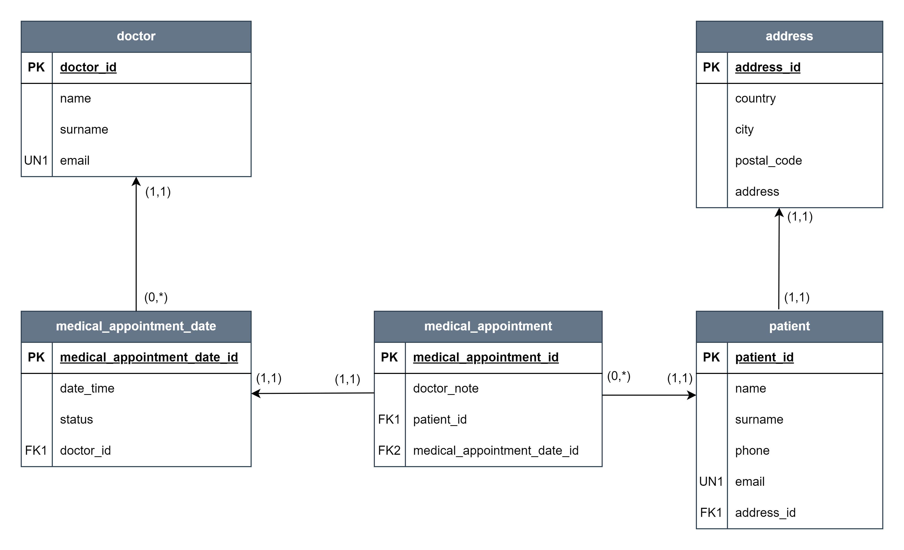

<h1 align="center">WEB CLINIC APPLICATION
</h1>

This project is a web application created in Spring Boot.
The application is an online clinic designed to medical appointments.
It is directed to two groups: patients and doctors.
Each group has access to a different area of the application.
After build the project according to the directions in the section `How to build the project on your own`
You can check this project out by yourself
on [Web-Clinic-Application](http://localhost:8087/web-clinic-application) - ThymeLeaf.
If you want to see API, you can
go to [Swagger UI](http://localhost:8087/web-clinic-application/swagger-ui/index.html).
If you want to see the documentation of my API, you can
go to [API documentation](http://localhost:8087/web-clinic-application/v3/api-docs/default).
This is the contract. This is the actual documentation that sticks to the OpenApi specification.

## Diagram ERD

Entity Relationship Diagram illustrates the relationship of entities in the database.



## REST API Endpoints

|                   ENDPOINT                    | METHOD |                                           REQUEST                                           |             RESPONSE             |                                              FUNCTION                                              |
|:---------------------------------------------:|:------:|:-------------------------------------------------------------------------------------------:|:--------------------------------:|:--------------------------------------------------------------------------------------------------:|
|                 /api/doctors                  |  GET   |                                              -                                              |          JSON (doctors)          |                                Returns a list of available doctors                                 |
|     /api/doctors /{doctorEmail}/schedule      |  GET   |                                PATH VARIABLE (doctor email)                                 |         JSON (schedule)          |                    Returns medical appointment schedule with given email doctor                    |
|   /api/doctors /{doctorEmail}/schedule/note   | PATCH  | PATH VARIABLE (doctor email), REQUEST PARAM (date, patientName, patientSurname, doctorNote) |         JSON (schedule)          | Doctor can add note to appointment after patient visit.Returns medical appointment with added note |
|      /api/doctors /{doctorEmail}/history      |  GET   |                                PATH VARIABLE (doctor email)                                 |       JSON (doctorHistory)       |                    Returns medical appointment history with given email doctor                     |
|       /api/doctors/{doctorEmail}/dates        |  GET   |                                PATH VARIABLE (doctor email)                                 |         JSON (schedule)          |                    Returns medical appointment schedule with given email doctor                    |
|                 /api/patients                 |  GET   |                                              -                                              |         JSON (patients)          |                                Returns a list of available patients                                |
|     /api/patients /{patientEmail}/history     |  GET   |                                PATH VARIABLE (patient email)                                |      JSON (patientHistory)       |                    Returns medical appointment history with given email patient                    |
|   /api/patients /{patientEmail}/appointment   |  POST  |         PATH VARIABLE (patient email), REQUEST PARAM (doctorEmail, appointmentDate)         |    JSON (medicalAppointment)     |                      Patient can make medical appointment to selected doctor                       |
|    /api/patients /{patientEmail}/schedule     |  GET   |                                PATH VARIABLE (patient email)                                |    JSON (medicalAppointment)     |          Returns future medical appointments (minimum 24h after now) to selected patient           |
| /api/patients /{patientEmail}/schedule/cancel | DELETE |         PATH VARIABLE (patient email), REQUEST PARAM (doctorEmail, appointmentDate)         |    JSON (medicalAppointment)     |         Patient can cancel medical appointment (minimum 24h after now) to selected doctor          |
|               /api/registration               |  GET   |                                              -                                              | JSON (medicalAppointmentRequest) |                             Returns example patient registration data                              |
|               /api/registration               |  POST  |                            JSON BODY (MedicalAppointmentRequest)                            |          JSON (patient)          |                Make Registration Patient To System. Returns patient added to system                |
|                   /api/nfz                    |  GET   |                                    REQUEST PARAM (year)                                     |      JSON (nfzProviderDTO)       |  Returns a list of available providers for branch 16 - Zachodniopomorski from external API - NFZ.  |

## TECHNICAL REQUIREMENTS

### Solved Problems

During the development of this project I had to face of a bunch of problems. These are a few of them.
<ul>
    <li>Build code that is maximal encapsulated</li>
    <li>Stick to the SOLID rules</li>
    <li>Create ERD diagram</li>
    <li>Use Flyway migration scripts to create the database schema automatically</li>
    <li>Design and create entity classes to represent tables in the database</li>
    <li>Design and create repositories and methods to provide access to data and allow manipulation of that data. Recommended use of Spring Data JPA</li>
    <li>Create a service layer where the business logic will be defined</li>
    <li>Create a WEB layer and use Thymeleaf for it. Remembering about error handling and HTTP statuses. Remembering that the WEB layer is ultimately to allow users to work with the database</li>
    <li>Add input validation</li>
    <li>Use Actuator</li>
    <li>Secure the application from unauthorized access</li>
    <li>Ability to log into the application of users with different permissions, and therefore had access to other areas of the application</li>
    <li>Ability to register a new patient</li>
    <li>Write unit tests (Mockito), @DataJpaTest, @WebMvcTest and @SpringBootTest</li>
    <li>Expose my REST API that allows you to call GET, POST, PUT and DELETE endpoints</li>
    <li>Expose SwaggerUI</li>
    <li>Use some external API that you consume in your application</li>
    <li>Use Docker Compose</li>
</ul>

### What I'm going to do in the future

There are many things that I'm going to do in this project in the future. Few of them:
<ul>
    <li>Pagination of displayed results</li>
    <li>Write RestAssured tests to cover the case of each of the listed HTTP methods in your REST API</li>
    <li>Write Wiremock tests for an external API</li>
    <li>Authorization with JWT token and Spring Security</li>
    <li>Continuous integration and Continuous Deployment with CircleCi (to ECR AWS) or Jenkins</li>
</ul>

## BUSINESS REQUIREMENTS

### PATIENT:

<ul>
    <li>can make an appointment (up to 1h before the scheduled appointment)</li>
    <li>has access to his scheduled appointments and his appointment history</li>
    <li>the patient's history also includes a column with a doctor's note added after the appointment (future appointments have blank fields - null)</li>
    <li>can cancel a medical appointment (up to 24h before the scheduled appointment date)</li>
</ul>

### DOCTOR:

<ul>
    <li>has access to all patient appointments (sort by date)</li>
    <li>has an availability schedule for potential appointments (free appointments)</li>
    <li>has access to patient history</li>
    <li>can add a note for a patient after a visit or update an already added one - in the patient's history</li>
</ul>

## How to build the project on your own

#### To build the project:

<ol>
<li>Clone the repository:</li>

```
git clone https://github.com/lewy007/web-clinic-app.git
```

<li>Go to the folder with cloned repository</li> 
<li>Run the command:</li>

```
gradle build -x test
```

<li>In folder build/libs you should find a file named: web-clinic-app-{version}.jar</li>
<li>Run WebClinicApplication class</li>
</ol>

#### To build the docker image with Docker Compose:

<ol>
<li>Clone the repository:</li>

```
git clone https://github.com/lewy007/web-clinic-app.git
```

<li>Go to the folder with cloned repository</li> 

```
gradle build -x test
```

<li>In folder build/libs you should find a file named: web-clinic-app-{version}.jar</li>
<li>Run the command:</li>

```
docker-compose build
```

<li>Check images by using command:</li>

```
docker images
```

<li>Run app by using command:</li>

```
docker compose up -d
```

<li>Check docker compose by using command:</li>

```
docker compose ps
```

<li>Shut down app by using command:</li>

```
docker compose down
```

</ol>

## Learn More

You can learn more in
the [Spring Boot Actuator Web API Documentation](https://docs.spring.io/spring-boot/docs/current/actuator-api/htmlsingle/).
